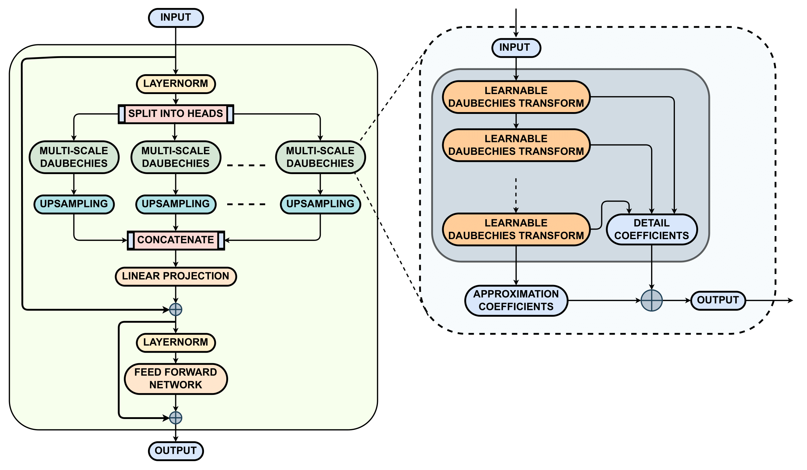

# DB2-TransF: All You Need Is Learnable Daubechies Wavelets for Time Series Forecasting



## Contributions :trophy:

- We introduce DB2-TransF, a novel linear time series forecasting model that replaces the traditional self-attention mechanism with a learnable Daubechies Wavelet module, significantly improving both predictive accuracy and computational efficiency.
- We demonstrate that the DB2-TransF model achieves superior performance and reduces computational requirements compared to existing transformer and MLP-based models, making it a scalable and resource-efficient solution for time series forecasting.
- We conduct an in-depth empirical analysis across multiple diverse time series datasets to showcase the model's effectiveness, generalization capabilities, and ability to efficiently capture multi-scale patterns.

## Setup :hourglass_flowing_sand:

### Creating the Environment

```bash
conda env create -f env.yaml
conda activate dbtransf
```

### Datasets

All the datasets can be obtained from [Google Drive](https://drive.google.com/file/d/1eY9rN2s5kT4N7Hp4uwUTcu2OlV6PCfpk/view?usp=sharing).

### Train and evaluate

```bash
# ECL
bash ./scripts/ECL/DB_transF.sh
# Exchange
bash ./scripts/Exchange/DB_transF.sh
# Traffic
bash ./scripts/Traffic/DB_transF.sh
# Weather
bash ./scripts/Weather/DB_transF.sh
# Solar-Energy
bash ./scripts/SolarEnergy/DB_transF.sh
# PEMS
bash ./scripts/PEMS/DB_transF_03.sh
bash ./scripts/PEMS/DB_transF_04.sh
bash ./scripts/PEMS/DB_transF_07.sh
bash ./scripts/PEMS/DB_transF_08.sh
# ETT
bash ./scripts/ETT/DB_transF_ETTm1.sh
bash ./scripts/ETT/DB_transF_ETTm2.sh
bash ./scripts/ETT/DB_transF_ETTh1.sh
bash ./scripts/ETT/DB_transF_ETTh2.sh
```

## Citation

If you find our work useful in your research, please consider citing us:

```
@misc{gupta2025db2transf,
  title={DB2-TransF: All You Need Is Learnable Daubechies Wavelets for Time Series Forecasting},
  author={Gupta, Moulik and Tripathi, Achyut Mani},
  year={2025}
}
```
